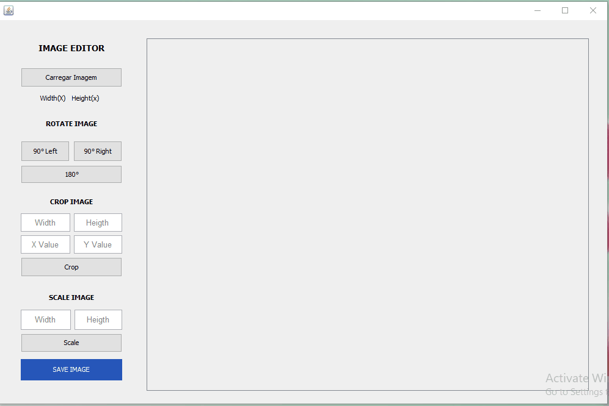

# Editor de Imagem

O presente projecto tem como objectivo demostrar as operações básicas de manipulação de imagens, foi desenvolvida com recurso a linguaguem java, para o  2° trabalho prático da disciplina de **Opção II**, **4° ano Informática** - **Universidade Eduardo Mondlane**.

## Operações disponivel

O editor permite efectuar as seguintes operações.

- Rotação (180°, 90° para esquerda e direita)
- Corte de imagem
- Escala
- Translação

## Demonstração

 